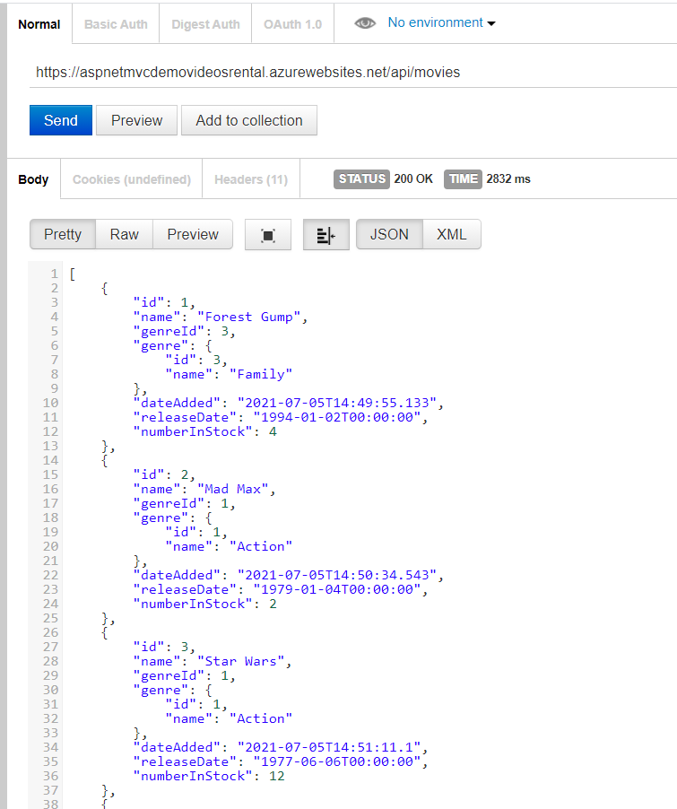
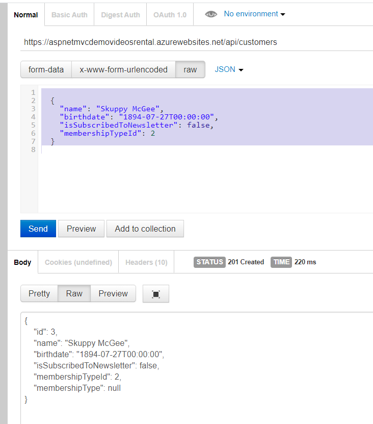
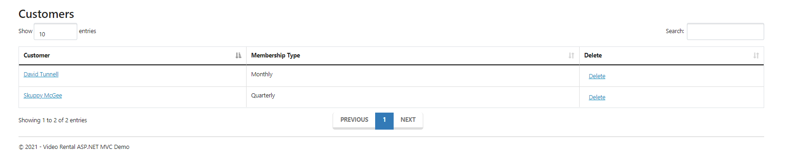

# ASP.NET 4.7.2 MVC CRUD and API Demo

I followed along with the Udemy course 'The Complete ASP.NET MVC 5 Course' by Mosh Hamedani for this project. ASP.NET MVC is a server-side web framework for building dynamic, data-driven web applications. Create, Read, Update, Delete functionality was created for both forms and through a custom created RESTful Web API.

A live demo can be found here: https://aspnetmvcdemovideosrental.azurewebsites.net

I worked on the following skills while building this. 

*.NET MVC
*Entity Framework (Code First)
*Domain Model Business Rules
*Form building and CRUD
*Client and Server Side Validation
*Business Rule Validation
*Building a RESTful API Service (Web API)
*Data Transfer Objects (DTOs)
*Automapper Configuration
*jQuery and Client Side API consumption (AJAX)
*Deploying to Azure via Visual Studio

## Example API Calls

Call all movie entries: https://aspnetmvcdemovideosrental.azurewebsites.net/api/movies

Create a customer: 

You can POST to https://aspnetmvcdemovideosrental.azurewebsites.net/api/customers with JSON in the following format. 

`{
    "name": "Skuppy McGee",
    "birthdate": "1894-07-27T00:00:00",
    "isSubscribedToNewsletter": false,
    "membershipTypeId": 2
  }`

Results in Postman:

Now showing in the application:

On the Movies/Customers (https://aspnetmvcdemovideosrental.azurewebsites.net/Movies) page the delete uses AJAX via jQuery to call the API.